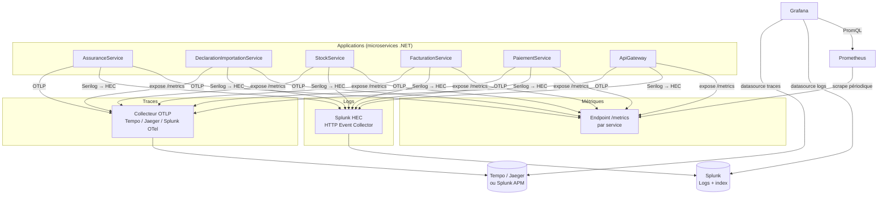
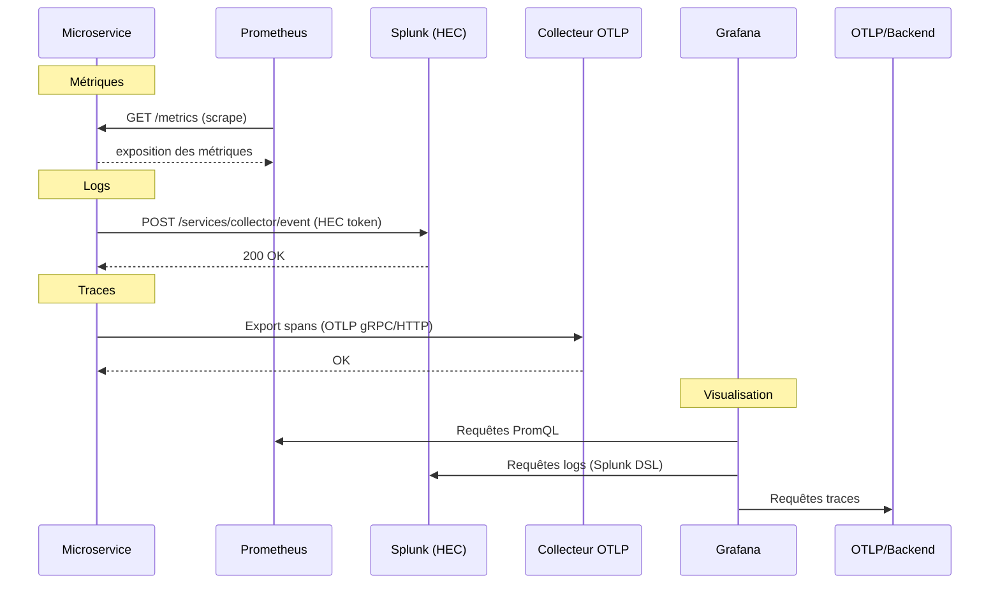
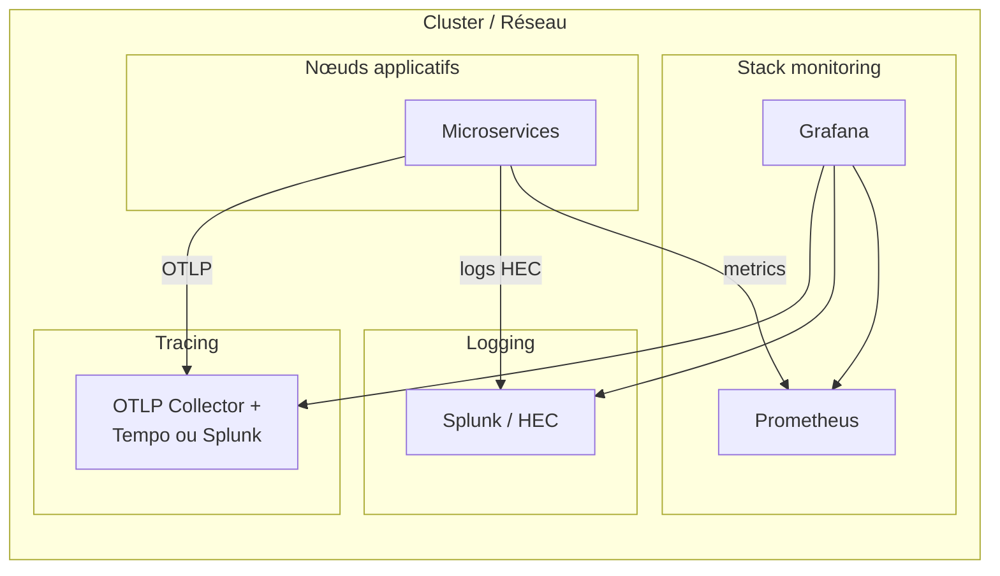

# Architecture Observabilité – Microservices, Prometheus, Grafana, Splunk

Ce document décrit comment les microservices et les briques d’observabilité (Prometheus, Grafana, Splunk) sont interconnectés.

---

## 1. Vue d’ensemble (flux de données)

```
                    ┌─────────────────────────────────────────────────────────────────┐
                    │                     COUCHE APPLICATIONS                           │
                    │  ┌──────────────┐ ┌──────────────┐ ┌──────────────┐               │
                    │  │ Assurance    │ │ Declaration  │ │ Stock        │  ... autres   │
                    │  │ Service      │ │ Importation  │ │ Service      │   microservices
                    │  │ (API .NET)   │ │ Service      │ │ (API .NET)   │               │
                    │  └──────┬───────┘ └──────┬───────┘ └──────┬───────┘               │
                    │         │                │                │                        │
                    └─────────┼────────────────┼────────────────┼────────────────────────┘
                              │                │                │
         ┌────────────────────┼────────────────┼────────────────┼────────────────────┐
         │                    │    MÉTRIQUES   │                │                    │
         │                    ▼                ▼                ▼                    │
         │             ┌─────────────────────────────────────────────┐               │
         │             │  Exposition /metrics (OpenTelemetry ou       │               │
         │             │  AspNetCore.Diagnostics) sur chaque service  │               │
         │             └──────────────────────┬──────────────────────┘               │
         │                                      │ scrape (HTTP)                        │
         │                                      ▼                                      │
         │             ┌─────────────────────────────────────────────┐               │
         │             │              PROMETHEUS                      │               │
         │             │  (stockage séries temporelles, PromQL,       │               │
         │             │   règles d’alerting)                        │               │
         │             └──────────────────────┬──────────────────────┘               │
         │                                      │ requêtes (PromQL)                    │
         └──────────────────────────────────────┼─────────────────────────────────────┘
                                                │
         ┌──────────────────────────────────────┼─────────────────────────────────────┐
         │                    LOGS              │         TRACES                      │
         │  Chaque microservice                  │  Chaque microservice                 │
         │  (Serilog / ILogger)                  │  (OpenTelemetry)                     │
         │         │                             │         │                            │
         │         ▼ HEC (HTTP)                  │         ▼ OTLP (gRPC/HTTP)           │
         │  ┌─────────────┐                      │  ┌─────────────┐                    │
         │  │   SPLUNK    │                      │  │   Tempo /   │                    │
         │  │   (HEC)     │                      │  │   Jaeger /  │                    │
         │  │   Logs      │                      │  │   Splunk OTEL│                    │
         │  └──────┬──────┘                      │  └──────┬──────┘                    │
         │         │                             │         │                            │
         └─────────┼─────────────────────────────┼─────────┼───────────────────────────┘
                   │                             │         │
                   │      ┌──────────────────────┴─────────┴──────────────────────┐
                   │      │                    GRAFANA                             │
                   │      │  Datasources : Prometheus, Splunk (logs), Tempo/Jaeger │
                   │      │  Dashboards : métriques, logs, traces (corrélation)     │
                   │      └───────────────────────────────────────────────────────┘
                   │
                   └──────────────► (optionnel) Grafana interroge Splunk pour les logs
```

---

## 2. Schéma détaillé des interconnexions (Mermaid)



---

## 3. Séquence des flux (qui envoie quoi à qui)



---

## 4. Récapitulatif des connexions

| De                    | Vers              | Protocole / Mécanisme        | Données        |
|-----------------------|-------------------|-----------------------------|----------------|
| Microservices         | Prometheus        | HTTP scrape (Prometheus tire) | Métriques      |
| Microservices         | Splunk            | HTTP (HEC) – push            | Logs           |
| Microservices         | Collecteur OTLP   | OTLP (gRPC ou HTTP) – push  | Traces (spans) |
| Grafana               | Prometheus        | HTTP (PromQL)               | Lecture métriques |
| Grafana               | Splunk            | API / datasource Splunk     | Lecture logs   |
| Grafana               | Backend traces    | API Tempo/Jaeger/Splunk     | Lecture traces |

---

## 5. Déploiement logique (containers / hosts)



---

## 6. Résumé

- **Microservices** : exposent `/metrics`, envoient les **logs** vers **Splunk (HEC)** et les **traces** vers un **collecteur OTLP** (Tempo, Jaeger ou Splunk).
- **Prometheus** : tire les métriques (scrape) depuis les microservices, stocke et sert les séries pour **Grafana** et l’alerting.
- **Splunk** : reçoit les logs via HEC ; peut aussi recevoir traces/métriques si vous utilisez Splunk Observability / OTel.
- **Grafana** : se connecte à **Prometheus** (métriques), **Splunk** (logs) et au backend de **traces** (Tempo/Jaeger/Splunk), pour des dashboards et une corrélation logs / traces / métriques.

Ainsi, les éléments sont interconnectés de façon claire et exploitable en production.
